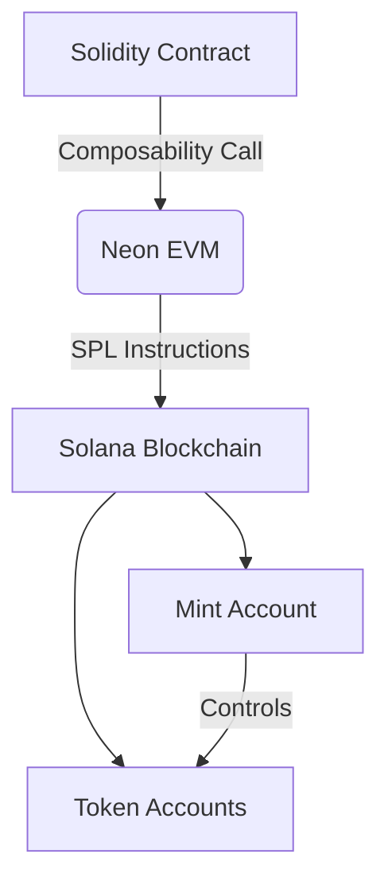

# Neon Dev Bootcamp – Week 4: SPL Token Program Library Implementation

## 🚀 Project Overview

This project demonstrates advanced cross-chain composability by interacting with Solana's SPL Token Program directly from Solidity contracts on Neon EVM. I've successfully created and managed SPL tokens entirely through Ethereum-compatible smart contracts.

## 🔍 Key Achievements

✅ **Created & Initialized SPL Token Mint**  

- Deployed new SPL token mint on Solana via Neon EVM
- Transaction: [`0x72e5aa607840cb5f3764ba3c0ae272c56c2783287eadff386ae0968ab799a643`](https://neon-devnet.blockscout.com/tx/0x72e5aa607840cb5f3764ba3c0ae272c56c2783287eadff386ae0968ab799a643)

✅ **Managed Token Accounts**  

- Created 3 types of token accounts:
  - Associated Token Account (ATA) for contract: `6GFhHAZjEATLJ8TNBk6XFM5Xxw1eoN6n6gGHhJWURagg`
  - Arbitrary account for deployer: `HrkRKjD4JsKekwWCGr6sTSkmTx5dwWSVcKmyfbTFz88Y`
  - Arbitrary account for Solana user: `7ckRexqzVZZM9cfV71VjrJfLkAbgBnJPgzmA7fr6NfoT`

✅ **Token Operations**  

- Minted tokens to deployer account (Balance: 1,000,000,000,000)
- Transferred tokens between accounts (Final deployer balance: 900,000,000,000)
- Transaction: [`0xfc6dd10b9a83d70ff1d67ceb5d875422abc53b6f4216451e5c770105b25a3d03`](https://neon-devnet.blockscout.com/tx/0xfc6dd10b9a83d70ff1d67ceb5d875422abc53b6f4216451e5c770105b25a3d03)

## 📊 Technical Implementation

### Contracts Deployed

1. **CallSPLTokenProgram**: [`0x2C66679B201962EfF6B85BDDa16f3846B28A3653`](https://neon-devnet.blockscout.com/address/0x2C66679B201962EfF6B85BDDa16f3846B28A3653)
2. **CallSystemProgram**: `0x2C19A94bc60f831b2c745B4D4b7177689deF465e`
3. **CallAssociatedTokenProgram**: `0x72597c0832922625C813F4b8279D49Fc3eE13516`

### Key Functions Tested

- `initializeMint2` - Created new SPL token
- `createAssociatedTokenAccount` - Made default token accounts
- `initializeAccount2` - Set up custom token accounts
- `mintTo` - Issued new tokens
- `transfer` - Moved tokens between accounts

## 🌉 Cross-Chain Architecture



## 📝 Key Learnings

1. **Account Models**:
   - Ethereum uses contract storage for balances
   - Solana requires explicit token account creation

2. **Authority Management**:
   - Proper authority assignment is crucial for SPL operations
   - Demonstrated through successful mint/transfer tests

3. **Composability**:
   - Neon EVM seamlessly bridges the EVM-Solana gap
   - All operations executed from Solidity with proper formatting

## 🛠 Setup & Execution

### Prerequisites

- Node.js v16+
- Hardhat environment
- Neon Devnet configuration
- Test NEON tokens from [faucet](https://neonfaucet.org)

### Clone the repository

   ```bash
   git clone https://github.com/codewithmide/NeonEVM-Bootcamp
   cd 04-SPLTokenProgramLibrary
   cp .env.example .env
   npm install
   ```

### Run Tests

```bash
npx hardhat test test/composability/spl-token.test.js --network neondevnet
```

This implementation showcases the power of Neon EVM's composability features, enabling true cross-chain DeFi applications that leverage the strengths of both Ethereum and Solana ecosystems.