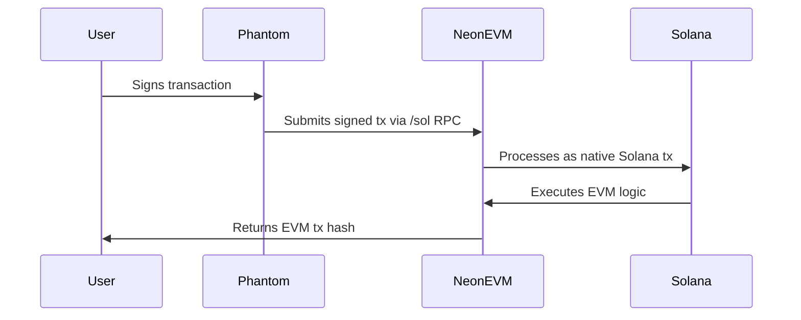

# Neon Dev Bootcamp – Week 6: Solana Native SDK Integration

## 🌉 Seamless Solana Wallet Integration with Neon EVM

This project demonstrates how to interact with EVM contracts directly using Solana wallets like Phantom, eliminating the need for MetaMask or asset bridging. The implementation showcases the power of Neon EVM's Solana Native SDK to create a unified blockchain experience.

## 🏆 Key Achievements

✅ **USDC Token Approval via Solana Wallet**  

- Approved 1,750,345,081 USDC from Solana wallet
- Transaction: [`0xfa6eb9b8ca0ded81d95c02104a8196e06730f6cd6869690359e9a05067605c93`](https://neon-devnet.blockscout.com/tx/0xfa6eb9b8ca0ded81d95c02104a8196e06730f6cd6869690359e9a05067605c93)
- Solana Signature: `7FHvkrsnq5DJmFAfzewkHhtE3H1qJuJND2zs6hPZfZSmYwWkW6wgw2QC4jLz6LX4EkSvq3owav5Vc2UjcxQiU6Y`

✅ **Cross-Chain USDC Transfer**  

- Sent 1,000,000 USDC between EVM addresses using Solana wallet
- Transaction: [`0x9750666aec2283fd8fcbd4e7a28d13afa287667669a0fe6a06047aa0245b2a9a`](https://neon-devnet.blockscout.com/tx/0x9750666aec2283fd8fcbd4e7a28d13afa287667669a0fe6a06047aa0245b2a9a)
- Balance changes:
  - Sender: 5,000,000 → 4,000,000
  - Receiver: 0 → 1,000,000

## 🔍 Technical Implementation

### Core Components

1. **Solana Native SDK**  
   - Bridges Solana wallet signatures to EVM transactions
   - Uses `/sol` RPC endpoint: `https://devnet.neonevm.org/sol`

2. **Key Addresses**  
   - Solana Payer: `21QpNtBDtm2k2uwTCU3HLPCBSN8Ssu3u1VdgM3HKZNNp`
   - Mapped Neon EVM Address: `0xa7cdb0a55d399545894823389ecf32a2dd771f34`
   - USDC Contract: `0x512E48836Cd42F3eB6f50CEd9ffD81E0a7F15103`

### Workflow Highlights



## 💡 Key Learnings

1. **Dual-Chain Transaction Flow**  
   - Solana transactions can encapsulate EVM contract calls
   - No proxy needed when using Solana Native SDK

2. **Address Mapping**  
   - Solana public keys automatically map to EVM addresses
   - Balance accounts created on-demand

3. **Gas Handling**  
   - `neon_estimateScheduledGas` calculates EVM gas costs
   - SOL used for transaction fees

4. **Approval Patterns**  
   - Single approval can cover multiple transactions
   - Max uint64 approval reduces future interactions

## 🛠 Setup & Execution

### Prerequisites

- Node.js v16+
- Funded Solana Devnet wallet
- Solana CLI tools

### Run Scripts

```bash
# Token approval
node token-approval-solana-signer-sdk.js

# Token transfer 
node token-transfer-solana-signer-sdk.js
```

## 🚀 Potential Use Cases

1. **Unified Wallet Experience** - Dapps supporting both chains with single wallet
2. **Cross-Chain DeFi** - Liquidity movements without bridging
3. **Enterprise Solutions** - Leveraging Solana's speed for EVM operations
4. **Wallet Abstraction** - MetaMask alternatives for EVM interactions
